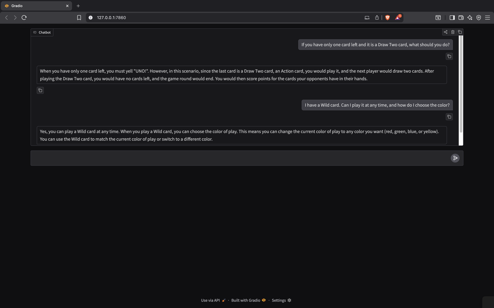

# Simple-UNO-Rules-Assistant
Built a grounded LLM-powered UNO rules assistant using Groq (LLaMA 3.3 70B), dynamically scraping and injecting authoritative rule content to reduce hallucinations, with real-time streaming responses via Gradio.

## Output

